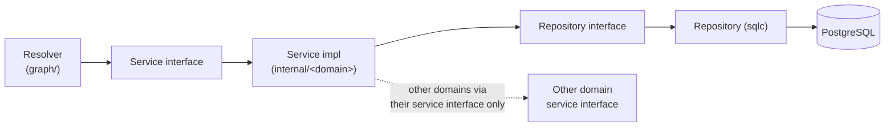
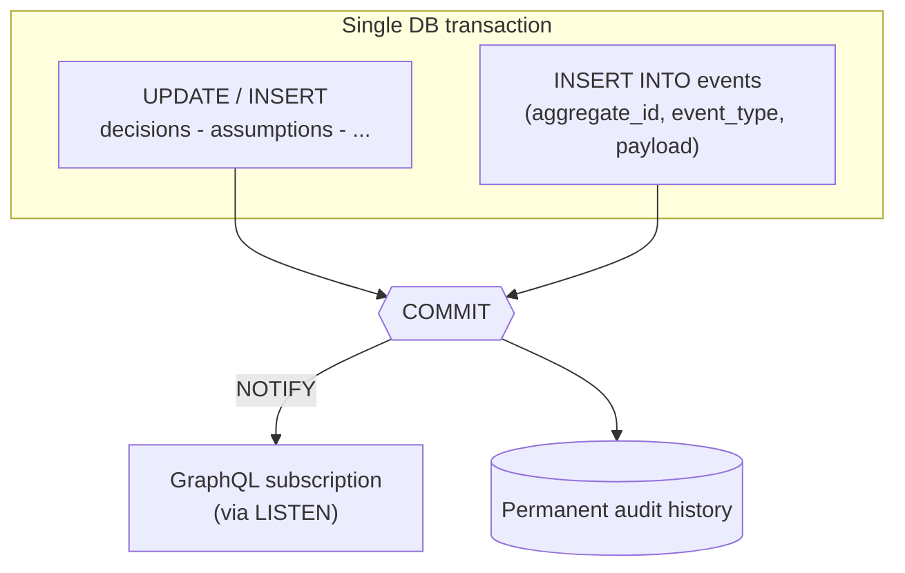
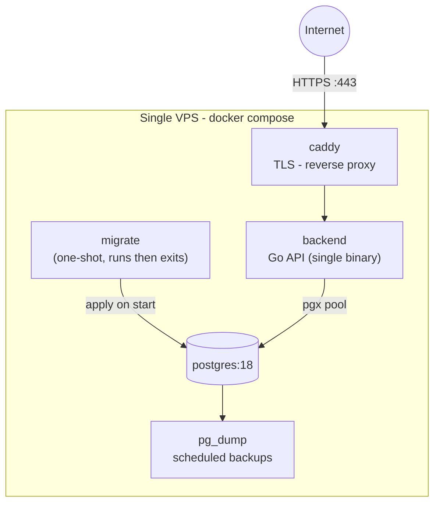

# Architecture

This document explains how Decision Intelligence OS is built and, more importantly, *why*. It is written for engineers evaluating the design and for contributors who need to extend it without eroding its invariants. Every major choice is backed by an [Architecture Decision Record](./adr/README.md).

## Goals and constraints

The system optimizes, in this order:

1. **Correctness** - the audit trail and analytics must never lie.
2. **Simplicity** - a single engineer should be able to hold the whole system in their head.
3. **Performance** - measured, not assumed; we optimize after profiling.

Hard constraints, adopted up front:

- **One deployable backend, one database, one web client, one mobile client.** No microservices.
- **PostgreSQL is the only datastore.** No Redis, MongoDB, Elasticsearch, Kafka, RabbitMQ, or NATS.
- **No ORM.** SQL is written by hand and checked at compile time.
- **GraphQL is the only public API.** REST exists solely for ops health checks.
- **The product is fully functional with AI disabled.** AI is an optional accelerant, never a dependency.

These constraints are not arbitrary minimalism. They keep the operational surface small enough that the project is genuinely maintainable by a small team, and they force domain boundaries to be expressed in code rather than papered over with network calls.

## Why a modular monolith

Microservices solve organizational scaling problems (many teams shipping independently) at the cost of enormous operational and correctness complexity: distributed transactions, eventual consistency, network partitions, schema-coordination across services. This project has one team and a domain that is *highly* relational - decisions, assumptions, evidence, predictions, and outcomes are tightly linked and frequently queried together.

A **modular monolith** gives us the benefit microservices are usually reaching for - clear bounded contexts - without the distributed-systems tax. Boundaries are enforced by the compiler and the dependency rule below; if we ever genuinely need to extract a service, the seams are already drawn. See [ADR-0001](./adr/0001-modular-monolith.md).

## Layering and the dependency rule

Every domain has the same four layers and exactly one allowed direction of dependency:

```text
GraphQL resolver (thin)  →  service (business logic + authz)  →  repository (sqlc)  →  Postgres
```



The rules, enforced in review and by import discipline:

- **Resolvers are thin.** They translate GraphQL input to service calls and service results to GraphQL payloads. No business logic.
- **Resolvers depend on service *interfaces*,** never on concrete services.
- **A service depends on its own repository interface** and on **other domains' service interfaces** - never on another domain's repository, models, or internal structs.
- **No import cycles.** Cross-domain communication happens by passing IDs through service interfaces.
- **All wiring is explicit** in a manual composition root in `cmd/api`. There is no DI framework. See [ADR-0007](./adr/0007-manual-composition-root.md).

This is why the modules stay modular even though they share a process and a database: a domain can only reach another domain through a small, intentional, typed contract.

## Bounded contexts

| Context | Responsibility |
| --- | --- |
| `auth` | Login, registration, session validation, token rotation, permissions. |
| `users` | Profiles and settings. |
| `teams` | Membership and roles. |
| `decisions` | Decision lifecycle and status machine. |
| `assumptions` | Assumptions and confidence scores. |
| `evidence` | Evidence storage and its links to assumptions. |
| `predictions` | Forecasts and probability estimates. |
| `outcomes` | Recorded actual results. |
| `analytics` | Forecast accuracy, calibration, success rate, team accuracy - computed from source data. |
| `ai` | Optional, isolated assistance. Disabled by default. |

Contexts communicate **by ID through service interfaces**. For example, `assumptions` does not import `decisions`' repository to validate a `decision_id`; it calls the `decisions` service. This keeps each context's persistence private and prevents the schema of one domain from leaking into another.

## The event model: audit log + transactional outbox

There is a single append-only `events` table: `(id, aggregate_id, event_type, payload, created_at)`. It plays two roles at once.

1. **Audit log.** Every meaningful state change (`DecisionCreated`, `AssumptionAdded`, `EvidenceAttached`, `PredictionCreated`, `OutcomeRecorded`, ...) is recorded permanently. Events are never deleted.
2. **Transactional outbox.** The same rows are the source of asynchronous fan-out (subscriptions, future projections).

The critical invariant: **the state change and its event are written in the same database transaction.** Either both commit or neither does. This makes it impossible for the audit log to disagree with the normalized tables.



This is **not** event sourcing. The **normalized tables remain the source of truth**; we never rebuild state by replaying events. Analytics are computed directly from the normalized `predictions` and `outcomes` data, not from the event stream. The events table is history and an outbox - nothing more. See [ADR-0004](./adr/0004-events-outbox-not-event-sourcing.md).

## GraphQL conventions

GraphQL is schema-first via gqlgen and is the only public API. See [ADR-0002](./adr/0002-graphql-only-api.md) and [ADR-0006](./adr/0006-relay-and-usererrors.md).

- **Relay-style cursor pagination** throughout: every list returns a `Connection`/`Edge` shape with opaque cursors and `PageInfo`. No offset pagination.
- **Mutations take a single `input` object and return a typed `Payload`.** Each payload carries the affected entity *and* a `userErrors: [UserError!]!` list. Expected, recoverable validation failures (e.g. "confidence must be between 0 and 1") are returned as **data** in `userErrors`, not as transport-level GraphQL errors. Clients render them inline without try/catch.
- **Unexpected and authorization failures** are GraphQL errors carrying a stable `extensions.code`: `UNAUTHENTICATED`, `FORBIDDEN`, `NOT_FOUND`, `CONFLICT`, `VALIDATION`, `INTERNAL`.
- **Per-request DataLoaders** batch and cache lookups to eliminate N+1 queries across resolver fan-out.
- **Subscriptions** run over `graphql-ws`, backed by Postgres `LISTEN/NOTIFY` - no separate broker. See [ADR-0003](./adr/0003-postgres-only-listen-notify.md).
- **Query complexity limits** protect the server from abusive queries. **Introspection is disabled in production.**

All types are strongly typed; generic `JSON` scalars for domain data are disallowed.

## Data model conventions

- **UUIDv7 primary keys**, generated in the application. UUIDv7 is time-ordered, so it indexes well as a primary key while remaining globally unique and non-enumerable.
- **`timestamptz`, always UTC.**
- **Foreign keys with explicit `ON DELETE`** behavior - referential integrity is the database's job.
- **`CHECK` constraints** for invariants: confidence and probability are constrained to `0..1`; status enums are `text` columns with `CHECK (status IN (...))`.
- **Indexes on every FK** and on the `(team_id, created_at DESC)` paths that back team-scoped listings.
- **JSONB only where genuinely justified** (e.g. event payloads), never as a substitute for modeling.
- **No soft deletes.** Lifecycle is modeled explicitly via `status`; the audit trail lives in `events`.

## Authentication and authorization

- Passwords hashed with **argon2id**.
- **Access tokens**: short-lived (~15m), **Ed25519-signed** JWTs.
- **Refresh tokens**: opaque, stored **hashed**, with **rotation and reuse detection**, delivered in an `httpOnly` + `Secure` + `SameSite=Strict` cookie. A replayed (already-rotated) refresh token invalidates the session family.
- **CSRF**: double-submit token.
- **RBAC**: roles `Admin`, `Member`, `Viewer`, all **team-scoped**. Authorization is enforced **server-side** in two layers - an `@authenticated` GraphQL directive gates authenticated fields, and **service-layer ownership and role checks** enforce row-level access. The frontend's view of permissions is never trusted.
- **Rate limiting** on auth endpoints is backed by Postgres (no Redis).
- Security headers are set on every response; all secrets come from the environment.

## Observability

- **Structured JSON logging** via `slog`. Every line carries `timestamp`, `level`, and `request_id`. Passwords, secrets, and tokens are never logged.
- **Request-ID middleware** assigns an ID at the edge and threads it through `context.Context`.
- **`/healthz`** (liveness) and **`/readyz`** (readiness, with a DB ping) are the only REST endpoints - for orchestration, not for clients.
- **Planned extension points:** Prometheus `/metrics` and OpenTelemetry tracing. The structured logging, request-ID propagation, and health surface above are implemented today; metrics and tracing are designed-for but not yet wired.

## Configuration

All configuration is via environment variables (see `.env.example`), loaded once at startup into a typed config struct. Notable flags: `GRAPHQL_INTROSPECTION` (off in prod), `GRAPHQL_COMPLEXITY_LIMIT`, token TTLs, cookie/CSRF settings, and `AI_ENABLED` (default `false`).

## Testing strategy

- **Service unit tests** are table-driven and run against **hand-written fakes** of the repository and collaborating service interfaces - no mocking framework, no code generation for tests.
- **Repository and GraphQL critical-path tests** are integration tests against a **real PostgreSQL** spun up by `testcontainers-go`, so SQL and constraints are exercised for real.
- Everything runs under the **race detector**: `go test -race -cover`.
- **Coverage targets:** services ≥ 90%, repositories ≥ 80%, GraphQL critical paths covered. Every bug fix adds a regression test.

## Deployment topology

The system deploys to a **single VPS** with Docker Compose. Caddy terminates TLS (automatic HTTPS) and reverse-proxies the Go backend. Migrations run as a **one-shot** step before the API starts. Backups are `pg_dump` on a schedule.



CI/CD is GitHub Actions: **Lint → Test → Build** (image pushed to GHCR) **→ Security** (`govulncheck`, `gosec`, `trivy`, `gitleaks`) **→ Deploy** (SSH `docker compose pull && up` on `main`). There are **no deploys from local machines**, and **Conventional Commits** are enforced.

## Decision records

The reasoning behind each load-bearing choice lives in [`adr/`](./adr/README.md):

- [0001 - Modular monolith over microservices](./adr/0001-modular-monolith.md)
- [0002 - GraphQL as the only public API](./adr/0002-graphql-only-api.md)
- [0003 - PostgreSQL as the sole datastore; LISTEN/NOTIFY for pub/sub](./adr/0003-postgres-only-listen-notify.md)
- [0004 - Append-only events: audit log + outbox, not event sourcing](./adr/0004-events-outbox-not-event-sourcing.md)
- [0005 - sqlc + golang-migrate instead of an ORM](./adr/0005-sqlc-over-orm.md)
- [0006 - Relay connections and the userErrors mutation pattern](./adr/0006-relay-and-usererrors.md)
- [0007 - Manual dependency-injection composition root](./adr/0007-manual-composition-root.md)
- [0008 - AI as an optional, isolated, disabled-by-default module](./adr/0008-ai-optional-isolated.md)
