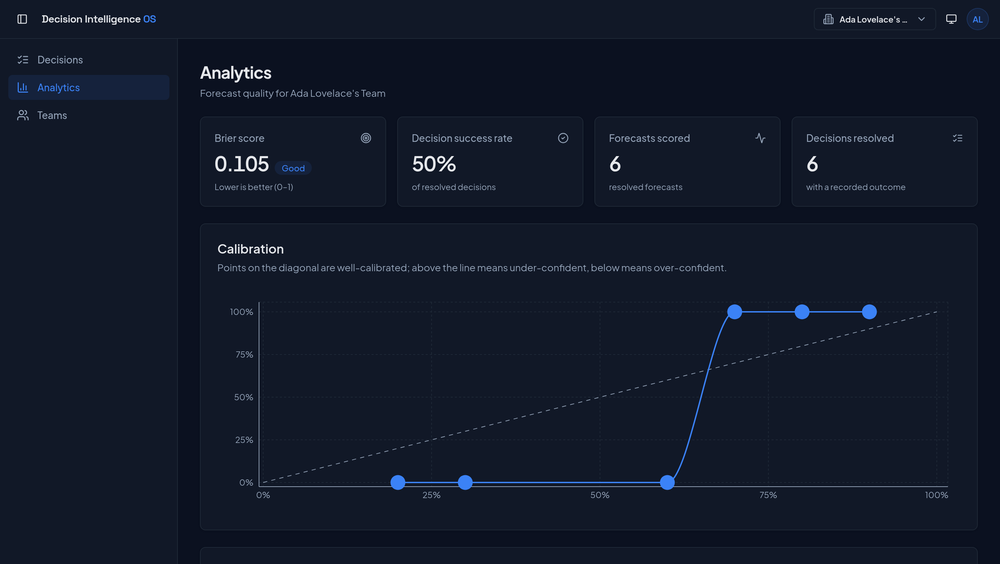
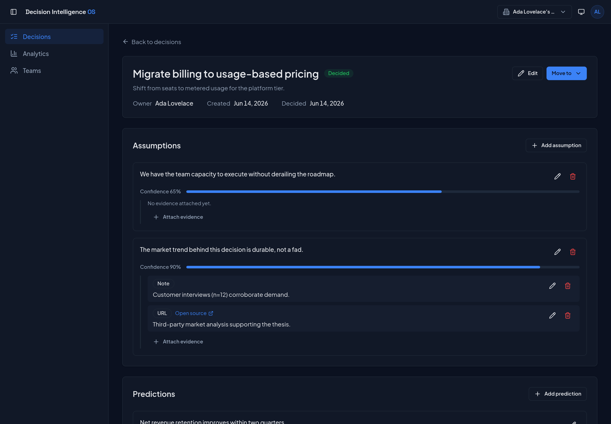
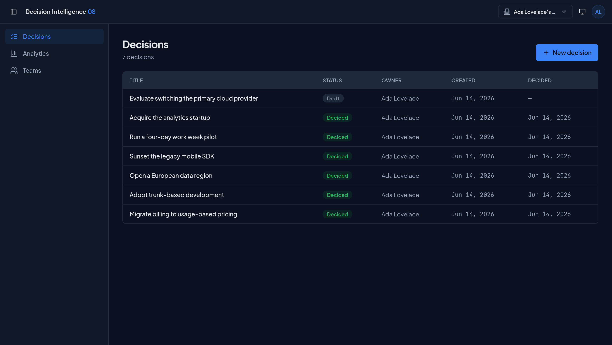
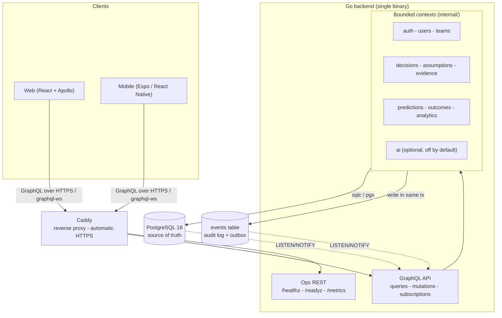
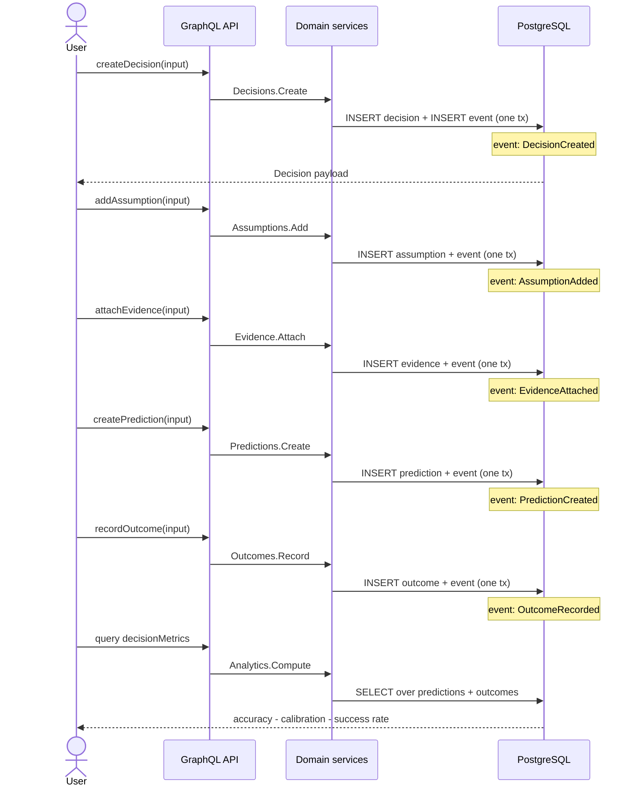

# Decision Intelligence OS

> A decision-quality platform for founders and operators - forecast outcomes, track assumptions, and measure how good your decisions actually were.

[](https://github.com/michaelgavalas/decision-intelligence-os/actions/workflows/ci.yml)
[](https://github.com/michaelgavalas/decision-intelligence-os/actions/workflows/security.yml)
[](#testing)
[](https://go.dev)
[](https://www.postgresql.org)
[](https://graphql.org)
[](./LICENSE)

---

## What it is

Most software helps you *do* work. Almost none helps you find out whether your **judgment** was any good.

Decision Intelligence OS is a platform for making - and grading - high-stakes decisions. It is built around a single thesis: **a decision can only be improved if its quality is measured separately from its outcome.** A good decision can have a bad result (variance happens); a lucky decision can have a great one. The only way to get better over time is to record what you believed *before* you acted, then compare it honestly to what actually happened.

This is **not** a note-taking app and **not** a project manager. It is an opinionated instrument for decision quality.

### The workflow

1. **Create a decision** - frame the question and the options.
2. **Record assumptions** - the beliefs the decision rests on, each with an explicit confidence (0-1).
3. **Attach evidence** - sources that support or undermine each assumption.
4. **Forecast outcomes** - concrete predictions with calibrated probabilities.
5. **Execute** the decision in the real world.
6. **Record the actual outcome** - what really happened.
7. **Measure decision quality** - forecast accuracy, calibration (Brier score), decision success rate, and team accuracy, all computed from source data.

## Why

Founders and operators make dozens of consequential bets and almost never close the loop on them. Calibration - the discipline of knowing how much to trust your own confidence - is a learnable skill, but only with feedback. Decision Intelligence OS makes that feedback loop a first-class product surface, with a complete, immutable audit trail of how each decision evolved.

## Features

- **Structured decision lifecycle** with an explicit status machine (no soft deletes - lifecycle is modeled, not faked).
- **Assumption tracking** with confidence scores and direct evidence links.
- **Probabilistic forecasting** - predictions carry calibrated probabilities, scored after the fact.
- **Decision-quality analytics** computed live from normalized source data: accuracy, calibration, success rate, per-team accuracy.
- **Append-only event log** that doubles as an audit trail and a transactional outbox.
- **Team-scoped RBAC** (Admin / Member / Viewer) enforced entirely server-side.
- **Real-time updates** via GraphQL subscriptions backed by Postgres `LISTEN/NOTIFY`.
- **Optional AI assistance** (disabled by default) that can summarize evidence, critique assumptions, and flag bias - never required, never in the critical path.

## Screenshots

The web client (React + Vite + Apollo, Tailwind v4) in dark mode.

**Decision-quality analytics** - Brier score, a calibration curve against the perfect-calibration diagonal, and success rate, all computed live from source data.



**Decision lifecycle** - assumptions with explicit confidence, linked evidence, predictions, and the recorded outcome.



**Decisions** - a team's decisions with status, owner, and dates.



## Architecture at a glance

A **modular monolith** in Go: one deployable backend binary, one PostgreSQL database, one web client, one mobile client. No microservices, no message brokers, no Redis. Bounded contexts are enforced in code, not over the network.



State changes and their corresponding events are written in the **same database transaction**, so the audit log can never drift from reality. See [ARCHITECTURE.md](./ARCHITECTURE.md) for the full narrative and the [ADR index](./adr/README.md) for the reasoning behind each major choice.

### The decision lifecycle, end to end

Each step persists a row in a normalized table *and* appends an event in the same transaction:



## Tech stack

| Layer | Choice | Why |
| --- | --- | --- |
| Language | **Go 1.25+** | Simple, fast, excellent concurrency and tooling. |
| HTTP router | **Chi** | Lightweight, idiomatic, `net/http`-native middleware. |
| API | **gqlgen** (schema-first GraphQL) | Type-safe resolvers from a single schema of record. |
| DB driver | **pgx/v5** | High-performance native Postgres driver. |
| SQL | **sqlc** | Compile-time-checked queries, no ORM, no runtime surprises. |
| Migrations | **golang-migrate** | Versioned, reversible, idempotent SQL migrations. |
| Database | **PostgreSQL 18** | The single source of truth - and the message bus. |
| Real-time | **graphql-ws + Postgres `LISTEN/NOTIFY`** | Subscriptions without a separate broker. |
| Auth | **argon2id**, **Ed25519** JWTs, rotating refresh tokens | Modern, audited primitives. |
| Observability | **slog** (JSON) + request-ID propagation; health/readiness probes | Structured logs and `request_id` on every line; Prometheus/OpenTelemetry are planned extension points. |
| Web | TypeScript, React, Vite, Apollo Client, React Router | Shared GraphQL contract with mobile. |
| Mobile | Expo, React Native | Decision capture, review, voice notes, notifications. |
| Infra | Docker, Docker Compose, Caddy, GitHub Actions | One VPS, automatic HTTPS, CI-driven deploys. |

Deliberately **not** used: Redis, MongoDB, Elasticsearch, Kafka, RabbitMQ, NATS, or any ORM. See [ADR-0003](./adr/0003-postgres-only-listen-notify.md) and [ADR-0005](./adr/0005-sqlc-over-orm.md).

## Project structure

```text
decision-intelligence-os/
├── backend/                 # Go modular monolith
│   ├── cmd/api/             # entrypoint + manual composition root (DI wiring)
│   ├── internal/            # bounded contexts
│   │   ├── auth/  users/  teams/
│   │   ├── decisions/  assumptions/  evidence/
│   │   ├── predictions/  outcomes/  analytics/
│   │   └── ai/              # optional, disabled by default
│   ├── graph/               # GraphQL schema + generated resolvers
│   ├── migrations/          # golang-migrate SQL (up/down)
│   ├── sql/                 # sqlc query sources
│   └── pkg/                 # shared, dependency-free helpers
├── web/                     # React web client (reserved)
├── mobile/                  # Expo mobile client (reserved)
├── infra/                   # docker-compose, Dockerfile.backend, Caddyfile, scripts
├── adr/                     # architecture decision records (MADR)
├── .github/                 # CI/CD workflows + templates
├── ARCHITECTURE.md
├── CONTRIBUTING.md
└── README.md
```

Each domain follows the same internal shape: a thin **GraphQL resolver** → a **service** (business logic + authorization) → a **repository** (sqlc) → **Postgres**.

## Quickstart

### Run the full stack with Docker

```bash
cp .env.example .env          # then set JWT keys and CSRF secret
docker compose -f infra/docker-compose.yml up --build
```

This starts PostgreSQL 18, runs migrations as a one-shot step, builds the Go backend, and fronts everything with Caddy (automatic HTTPS).

- GraphQL endpoint: **https://localhost/graphql**
- Liveness: **https://localhost/healthz** - Readiness: **https://localhost/readyz**

### Local development

```bash
make help          # list all targets
make generate      # sqlc + gqlgen code generation
make migrate-up    # apply migrations
make run           # run the API on $PORT
make lint          # gofmt + golangci-lint
make test-race     # go test -race with coverage
```

## Testing

- **Service unit tests** - table-driven, against hand-written fakes (no mocking framework).
- **Repository & GraphQL critical-path integration tests** - against a real PostgreSQL via `testcontainers-go`.
- Always run with the race detector: `make test-race` (`go test -race -cover`).
- **Coverage targets:** services ≥ 90%, repositories ≥ 80%, GraphQL critical paths covered; CI enforces a ≥ 60% gate on hand-written code (generated code excluded).
- Every bug fix ships with a regression test.

## Security highlights

- **argon2id** password hashing.
- Short-lived (~15m) **Ed25519-signed JWT** access tokens.
- Opaque **refresh tokens** stored hashed, with rotation and reuse detection, in an `httpOnly` + `Secure` + `SameSite=Strict` cookie.
- **CSRF** double-submit protection.
- **RBAC** (Admin/Member/Viewer) enforced server-side via GraphQL directives *and* service-layer ownership checks - frontend permissions are never trusted.
- **Postgres-backed rate limiting** on auth endpoints (no Redis).
- Security headers, secrets via environment, GraphQL introspection disabled in production.
- CI security gate: `govulncheck`, `gosec`, `trivy`, `gitleaks`.

## Status & roadmap

The backend and web client work end to end - auth, the full decision lifecycle, and live analytics. This is a reference/portfolio implementation rather than a hosted product, and a few things are deliberately scoped out for now.

**Known limitations**

- Evidence is captured as a URL or free text - no file uploads or attachments yet.
- Team members are added by user ID; there is no email-invitation flow.
- Predictions can be created and edited but not deleted (outcomes stay immutable once recorded).
- Calibration is computed point-in-time; there's no calibration-over-time view yet.
- The mobile client (Expo / React Native) is scaffolded but not built.

**Open questions I'm still weighing**

- Should a recorded outcome be editable, or should a correction append a new event so the audit trail stays intact?
- What's the right unit for calibration - per decision, per assumption, or per individual forecaster?
- How should a forecast's contribution to the Brier score be weighted by stakes without making it gameable?
- Is `LISTEN/NOTIFY` sufficient for real-time at multi-tenant scale, or does it eventually need a dedicated fan-out layer?

**Next up**

- Mobile capture (decisions, review, voice notes, push).
- Decision templates and reusable assumption libraries.
- Calibration training mode with historical replay.

## Documentation

- [ARCHITECTURE.md](./ARCHITECTURE.md) - deep architecture narrative and diagrams.
- [CONTRIBUTING.md](./CONTRIBUTING.md) - how to set up, build, test, and contribute.
- [CHANGELOG.md](./CHANGELOG.md) - notable changes.
- [adr/](./adr/README.md) - architecture decision records.

## License

Released under the [MIT License](./LICENSE). Copyright (c) 2026 Michael Gavalas.
